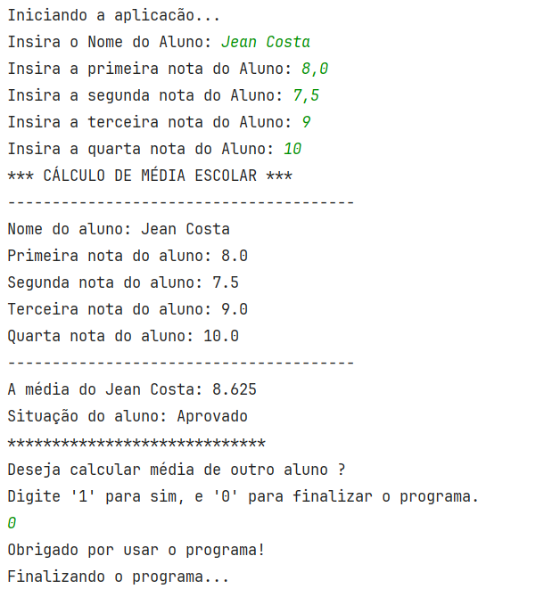

# Média de Alunos



## 📌 Descrição
Aplicação simples em **Java** para calcular a média de um aluno e determinar se ele foi aprovado ou reprovado com base nas notas fornecidas.

## 🚀 Tecnologias
- Java
- Lógica Condicional

## 📂 Como executar
1. Certifique-se de ter o **JDK 17+** instalado.
2. Compile o programa:
   ```bash
   javac MediaAluno.java

## Autor
[Jean Costa](<https://www.linkedin.com/in/jean090504/>)
